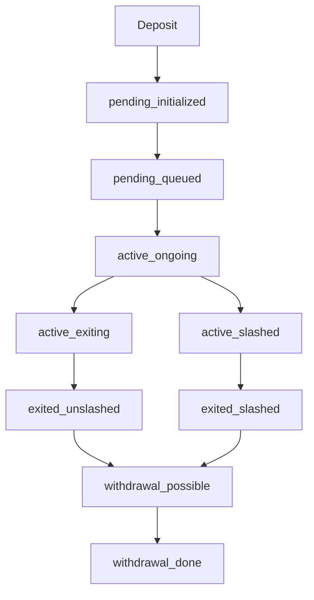

This page provides detailed information about validator states returned by the SSV Node API.

## Validator Lifecycle

Validators progress through several states during their lifecycle on the beacon chain:



## Status Descriptions

### Pending States

Validators waiting to become active.

<AccordionGroup>
  <Accordion title="pending_initialized">
    The deposit has been recognized by the beacon chain but the validator is not yet in the activation queue.
    
    **What this means**: Your deposit has been processed but you're waiting for the queue.
    
    **Expected duration**: Until the next epoch boundary
  </Accordion>
  
  <Accordion title="pending_queued">
    The validator is in the activation queue waiting for its activation epoch.
    
    **What this means**: You're in line to become active.
    
    **Expected duration**: Depends on queue length (can be hours to days)
  </Accordion>
</AccordionGroup>

### Active States

Validators currently performing duties.

<AccordionGroup>
  <Accordion title="active_ongoing">
    The validator is active and performing attestation, proposal, and sync committee duties.
    
    **What this means**: Everything is working correctly. The validator is earning rewards.
    
    **Actions**: Monitor performance and ensure uptime
  </Accordion>
  
  <Accordion title="active_exiting">
    The validator has initiated a voluntary exit but is still active until the exit epoch.
    
    **What this means**: Exit is in progress, validator continues duties until exit epoch.
    
    **Expected duration**: Minimum of 256 epochs (~27 hours)
  </Accordion>
  
  <Accordion title="active_slashed">
    The validator was slashed but hasn't reached its exit epoch yet.
    
    **What this means**: Critical - validator violated consensus rules and is being penalized.
    
    **Actions**: Investigate immediately to prevent further slashing
  </Accordion>
</AccordionGroup>

### Exited States

Validators that have stopped performing duties.

<AccordionGroup>
  <Accordion title="exited_unslashed">
    The validator has exited cleanly (voluntary exit).
    
    **What this means**: Validator successfully exited, no penalties.
    
    **Next step**: Wait for withdrawal epoch
  </Accordion>
  
  <Accordion title="exited_slashed">
    The validator exited due to slashing.
    
    **What this means**: Validator was penalized and forcibly exited.
    
    **Next step**: Review slashing event and await withdrawals (with penalties applied)
  </Accordion>
</AccordionGroup>

### Withdrawal States

Validators in the withdrawal process.

<AccordionGroup>
  <Accordion title="withdrawal_possible">
    The validator has reached its withdrawal epoch and withdrawals can be processed.
    
    **What this means**: Funds can now be withdrawn.
    
    **Timeline**: Automatic after the withdrawal epoch
  </Accordion>
  
  <Accordion title="withdrawal_done">
    All withdrawals have been processed and the validator lifecycle is complete.
    
    **What this means**: Validator is fully withdrawn, no more beacon chain activity.
  </Accordion>
</AccordionGroup>

## Checking Validator Status

### Via API

```bash
# Get status for specific validator
curl "http://localhost:16000/v1/validators?indices=123456" | jq '.data[0].status'
```

### Interpreting Missing Status

If the `status` field is empty (`""`), it means:

- The validator share exists in the SSV contract
- The validator has not yet been activated on the beacon chain
- The `index` field will be `0`
- The `activation_epoch` will be `0`

This is normal for newly registered validators that haven't deposited yet or are still processing.

## Monitoring Best Practices

### Alert on Status Changes

```bash
#!/bin/bash
# Monitor for slashing
STATUS=$(curl -s "http://localhost:16000/v1/validators?indices=123456" | jq -r '.data[0].status')

if [[ "$STATUS" == *"slashed"* ]]; then
  echo "CRITICAL: Validator slashed!"
  # Send alert
fi
```

### Track Activation Progress

```bash
# Check activation epoch
DATA=$(curl -s "http://localhost:16000/v1/validators?indices=123456" | jq '.data[0]')
STATUS=$(echo $DATA | jq -r '.status')
ACTIVATION_EPOCH=$(echo $DATA | jq -r '.activation_epoch')

if [[ "$STATUS" == "pending_queued" ]]; then
  echo "Activation scheduled for epoch $ACTIVATION_EPOCH"
fi
```

## Status vs Beacon Chain

The SSV Node API retrieves validator status from the configured beacon node. The status reflects the beacon chain state at the time of the last sync.

**Note**: There may be a slight delay between beacon chain state changes and API responses due to:

- Beacon node sync lag
- SSV node update intervals
- Network propagation delays

For real-time beacon chain status, cross-reference with:

- Beaconcha.in
- Your beacon node's API directly
- Block explorers

## Related Endpoints

- [List Validators](/api/validators/list) - Query validators with filters
- [Node Health](/api/node/health) - Check beacon node connectivity

## Source Code Reference

Status handling: `/home/daytona/workspace/source/api/handlers/validators/model.go:35`