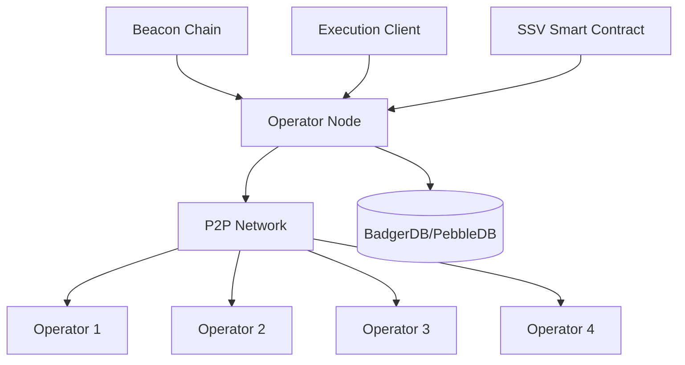

## System Overview

SSV Node implements a multi-layered architecture that coordinates distributed validator operations across multiple operators. The system combines Byzantine fault-tolerant consensus, threshold cryptography, and peer-to-peer networking to enable secure, decentralized Ethereum validator operation.



<Info>
The architecture follows event-driven and message queue patterns, enabling concurrent processing of multiple validator duties across different roles.
</Info>

## Core Components

### 1. Operator Node (`operator/`)

The **Operator Node** is the central orchestrator that manages the complete validator lifecycle. Located in `operator/node.go`, it coordinates all interactions between the blockchain, network, and protocol layers.

**Key Responsibilities:**

- Receives validator duties from the Beacon Chain
- Schedules duty execution based on slot timing
- Manages validator registration and deregistration
- Coordinates with other operators through the P2P network
- Handles fee recipient management

**Critical Data Flow:**

```
Beacon Chain → Duty Fetcher → Scheduler → Runner → Consensus → Beacon Submission
```

<Accordion title="Operator Node Structure (operator/node.go)">
```go
type Node struct {
    logger              *zap.Logger
    network             *networkconfig.Network
    validatorsCtrl      *validator.Controller
    consensusClient     beaconprotocol.BeaconNode
    executionClient     executionclient.Provider
    net                 network.P2PNetwork
    storage             storage.Storage
    qbftStorage         *qbftstorage.ParticipantStores
    dutyScheduler       *duties.Scheduler
    feeRecipientCtrl    fee_recipient.RecipientController
    exporterRead        *exporter2.Exporter
}
```
</Accordion>

### 2. SSV Protocol (`protocol/v2/`)

The **SSV Protocol** layer implements the core distributed validator protocol, including consensus and duty execution. This is where the magic of distributed validation happens.

#### QBFT Consensus (`protocol/v2/qbft/`)

SSV implements **Istanbul BFT (QBFT)**, a Byzantine fault-tolerant consensus algorithm that ensures operators agree on validator duties before signing.

**Consensus Flow:**

1. **Prepare Phase**: Operators exchange prepare messages
2. **Commit Phase**: Upon receiving 2f+1 prepares, operators send commits
3. **Decided**: With 2f+1 commits, consensus is reached
4. **Round Change**: If timeout occurs, operators move to next round

<Note>
QBFT can tolerate up to ⌊(n-1)/3⌋ Byzantine (malicious or faulty) operators. For 4 operators, 1 fault is tolerated; for 7 operators, 2 faults are tolerated.
</Note>

**Controller Implementation** (`protocol/v2/qbft/controller/controller.go`):

```go
type Controller struct {
    Identifier        []byte
    Height            specqbft.Height
    StoredInstances   InstanceContainer
    CommitteeMember   *spectypes.CommitteeMember
    OperatorSigner    ssvtypes.OperatorSigner
    NewDecidedHandler NewDecidedHandler
    config            qbft.IConfig
}

func (c *Controller) StartNewInstance(
    ctx context.Context,
    logger *zap.Logger,
    height specqbft.Height,
    value []byte,
    valueChecker ssv.ValueChecker,
) (*instance.Instance, error)
```

#### Runners (`protocol/v2/ssv/runner/`)

**Runners** execute specific validator duties through a common interface. Each duty type has a dedicated runner implementation:

- **Attestation Runner**: Handles epoch attestations
- **Proposal Runner**: Manages block proposals
- **Sync Committee Runner**: Executes sync committee duties
- **Aggregator Runner**: Aggregates attestations from other validators

**Runner Interface** (`protocol/v2/ssv/runner/runner.go`):

```go
type Runner interface {
    // StartNewDuty starts a new duty for the runner
    StartNewDuty(ctx context.Context, logger *zap.Logger, 
                 duty spectypes.Duty, quorum uint64) error
    
    // ProcessPreConsensus processes pre-consensus signatures
    ProcessPreConsensus(ctx context.Context, logger *zap.Logger, 
                       signedMsg *spectypes.PartialSignatureMessages) error
    
    // ProcessConsensus processes consensus messages
    ProcessConsensus(ctx context.Context, logger *zap.Logger, 
                    msg *spectypes.SignedSSVMessage) error
    
    // ProcessPostConsensus processes post-consensus signatures
    ProcessPostConsensus(ctx context.Context, logger *zap.Logger, 
                        signedMsg *spectypes.PartialSignatureMessages) error
    
    // OnTimeoutQBFT handles QBFT timeouts
    OnTimeoutQBFT(ctx context.Context, logger *zap.Logger, 
                  timeoutData *ssvtypes.TimeoutData) error
}
```

**Three-Phase Execution:**

<Steps>
  <Step title="Pre-Consensus">
    Each operator signs the duty data with their validator key share
  </Step>
  
  <Step title="Consensus (QBFT)">
    Operators reach Byzantine fault-tolerant agreement on which signatures to aggregate
  </Step>
  
  <Step title="Post-Consensus">
    Threshold signatures are aggregated into a complete validator signature and submitted to the Beacon Chain
  </Step>
</Steps>

### 3. P2P Network (`network/`)

The **P2P Network** layer handles all peer-to-peer communication between operators. Built on **libp2p**, it provides discovery, message routing, and gossip-based broadcasting.

**Network Architecture:**

- **Discovery**: Uses **discv5** protocol for peer discovery
- **Transport**: TCP and QUIC support for reliable communication
- **Pubsub**: **GossipSub** for efficient message broadcasting
- **Subnets**: Validator-specific subnets for message isolation

**Interface Design** (`network/network.go`):

```go
type P2PNetwork interface {
    protocolp2p.Network
    MessageRouting
    Setup() error
    Start() error
    io.Closer
}

// Protocol interfaces
type Network interface {
    Subscriber      // Manages topic subscriptions
    Broadcaster     // Enables message broadcasting
    Syncer          // Syncs data from peers
    ValidationReporting  // Reports validation results
}
```

**Message Flow:**

```
P2P Receive → Validation → Router → Duty Queue → Runner → State Update
```

<Warning>
All P2P messages are validated for signature correctness, sequence, and content before being processed. Invalid messages are rejected and can result in peer scoring penalties.
</Warning>

**Subnet Isolation:**

Each validator operates on a dedicated subnet identified by its public key. This ensures:

- **Scalability**: Operators don't receive messages for validators they don't manage
- **Privacy**: Validator communications are isolated
- **Efficiency**: Reduced bandwidth and processing overhead

### 4. Beacon Chain Integration (`beacon/`)

The **Beacon Chain Integration** layer interfaces with Ethereum's consensus layer to fetch duties and submit validator signatures.

**Core Functions:**

- Fetches validator duties for upcoming slots
- Retrieves Beacon Chain state and fork information
- Submits attestations, block proposals, and sync committee messages
- Supports multiple Beacon nodes for redundancy

**Duty Types:**

| Duty Type | Frequency | Description |
|-----------|-----------|-------------|
| Attestation | Every epoch (~6.4 min) | Vote on the current chain head |
| Block Proposal | When selected | Propose new blocks to the chain |
| Sync Committee | When assigned | Participate in light client support |
| Aggregation | When selected | Aggregate attestations from other validators |

**Redundancy:**

SSV Node supports multiple Beacon node connections. If one fails, the node automatically switches to a backup, ensuring high availability.

### 5. Contract Sync (`eth/`)

The **Contract Sync** component monitors the SSV smart contract on Ethereum mainnet for validator and operator events.

**Monitored Events:**

- **Validator Registered**: New validator added to the network
- **Validator Removed**: Validator deregistered
- **Operator Added**: New operator joined
- **Operator Removed**: Operator exited
- **Fee Recipient Updated**: Fee configuration changed
- **Cluster Liquidated**: Insufficient balance for cluster operation

**Event Processing Flow:**

```
Smart Contract Event → Event Sync → Handler → Validator Controller → Share Update
```

<Info>
The contract sync is event-driven, responding to blockchain events in real-time to maintain an up-to-date view of the SSV network state.
</Info>

### 6. Storage Layer (`storage/`, `registry/storage/`)

The **Storage Layer** provides persistent state management for validator shares, metadata, and consensus data.

**Storage Technologies:**

- **BadgerDB**: Default key-value store (mature, battle-tested)
- **PebbleDB**: Alternative high-performance option
- **In-Memory Caches**: For frequently accessed data

**Stored Data:**

- Validator shares and operator assignments
- Consensus instance state and decided values
- Slashing protection database (prevents double-signing)
- Duty execution history
- Network metadata and configuration

**Encoding:**

SSV uses **SSZ (Simple Serialize)** encoding for efficient storage and network transmission. SSZ is the standard serialization format in Ethereum 2.0.

```go
// Storage interfaces abstract database operations
type Shares interface {
    Get(txn basedb.Reader, pubKey []byte) (*storage.Share, error)
    List(txn basedb.Reader, filters ...SharesFilter) ([]*storage.Share, error)
    Save(txn basedb.ReadWriter, share *storage.Share) error
    Delete(txn basedb.ReadWriter, pubKey []byte) error
}
```

## Design Patterns

SSV Node employs several architectural patterns for reliability and maintainability:

### Message Queue Pattern

Each duty type has dedicated queues for concurrent processing, enabling parallel execution of multiple validators without blocking.

```
┌─────────────┐    ┌─────────────┐    ┌─────────────┐
│ Attestation │    │  Proposal   │    │Sync Committee│
│    Queue    │    │    Queue    │    │    Queue    │
└──────┬──────┘    └──────┬──────┘    └──────┬──────┘
       │                  │                  │
       └──────────────────┴──────────────────┘
                         │
                  ┌──────▼──────┐
                  │   Runners   │
                  └─────────────┘
```

### Event-Driven Architecture

The system responds to three types of events:

1. **Beacon Slots**: Time-based slot ticker triggers duty fetching
2. **Contract Events**: Smart contract updates trigger validator lifecycle changes
3. **P2P Messages**: Network messages trigger consensus and duty processing

### Repository Pattern

Clean storage interfaces abstract database operations, enabling:

- **Testability**: Easy mocking for unit tests
- **Flexibility**: Swap storage backends without code changes
- **Consistency**: Uniform access patterns across the codebase

### Strategy Pattern

Different runners implement a common interface for various duties, allowing the scheduler to treat all duty types uniformly while maintaining duty-specific logic.

## Critical Data Flows

### 1. Validator Duty Flow

The complete flow from duty detection to Beacon Chain submission:

<Steps>
  <Step title="Slot Ticker">
    Beacon slot ticker fires every 12 seconds
  </Step>
  
  <Step title="Duty Fetcher">
    Queries Beacon node for upcoming duties
  </Step>
  
  <Step title="Scheduler">
    Schedules duties for execution at the appropriate time
  </Step>
  
  <Step title="Runner Execution">
    Appropriate runner (attestation, proposal, etc.) begins execution
  </Step>
  
  <Step title="Pre-Consensus">
    Operator signs duty with validator key share
  </Step>
  
  <Step title="QBFT Consensus">
    Operators reach consensus on partial signatures
  </Step>
  
  <Step title="Post-Consensus">
    Threshold signatures are aggregated
  </Step>
  
  <Step title="Beacon Submission">
    Final signature submitted to Beacon Chain
  </Step>
</Steps>

### 2. Message Processing Flow

How P2P messages are validated and processed:

```
┌─────────────┐
│  P2P Receive│
└──────┬──────┘
       │
       ▼
┌─────────────┐
│  Validation │  ← Signature check, content validation
└──────┬──────┘
       │
       ▼
┌─────────────┐
│   Router    │  ← Route to correct validator/duty
└──────┬──────┘
       │
       ▼
┌─────────────┐
│    Queue    │  ← Enqueue for processing
└──────┬──────┘
       │
       ▼
┌─────────────┐
│   Runner    │  ← Process in consensus/duty context
└──────┬──────┘
       │
       ▼
┌─────────────┐
│State Update │  ← Update consensus state
└─────────────┘
```

### 3. Contract Event Flow

Response to smart contract events:

```
Smart Contract → Event Sync → Handler → Validator Controller → Share Update → Storage
```

**Example**: When a new validator is registered:

1. Event sync detects `ValidatorAdded` event
2. Handler extracts validator data and shares
3. Validator controller creates new validator instance
4. Shares are stored in the database
5. Runner is initialized for the new validator

## Package Structure

Understanding the Go package organization in `github.com/ssvlabs/ssv`:

| Package | Purpose | Key Files |
|---------|---------|-----------|
| `operator/` | Main node orchestration | `node.go`, `duties/scheduler.go` |
| `protocol/v2/qbft/` | QBFT consensus implementation | `controller/controller.go`, `instance/instance.go` |
| `protocol/v2/ssv/runner/` | Duty execution runners | `runner.go`, `attestation.go`, `proposal.go` |
| `network/` | P2P networking layer | `network.go`, `p2p/p2p.go` |
| `beacon/` | Beacon Chain integration | `goclient/*.go` |
| `eth/` | Smart contract synchronization | `eventhandler/`, `eventsyncer/` |
| `storage/` | Storage backends | `badger/`, `pebble/` |
| `registry/storage/` | Validator data persistence | `shares.go`, `validator_store.go` |

## Security Architecture

### Slashing Protection

SSV Node implements comprehensive slashing protection to prevent validator penalties:

- **Database-Backed Protection**: All signing operations check against historical data
- **Distributed Checks**: Each operator independently validates signing safety
- **Attestation Protection**: Prevents conflicting source/target votes
- **Proposal Protection**: Prevents double block proposals

### Key Isolation

Validator keys never exist in complete form:

```
Validator Key (Complete)
         │
         ├─ Split via Shamir Secret Sharing
         │
    ┌────┼────┬────┬────┐
    │    │    │    │    │
  Share1 Share2 Share3 Share4
    │    │    │    │    │
  Op #1  Op #2  Op #3  Op #4
```

**Threshold Requirements:**

- With 4 operators: Need 3 shares (75%)
- With 7 operators: Need 5 shares (71%)
- With 13 operators: Need 9 shares (69%)

<Warning>
Compromising a validator requires compromising at least 2f+1 operators simultaneously, making attacks significantly harder than single-operator setups.
</Warning>

### Message Validation

All network messages undergo rigorous validation:

1. **Signature Verification**: Cryptographic signature check
2. **Operator Verification**: Sender is part of the committee
3. **Sequence Validation**: Message ordering is correct
4. **Content Validation**: Message data passes role-specific checks
5. **Replay Protection**: Message hasn't been processed before

## Performance Optimizations

### Concurrent Processing

SSV Node leverages Go's concurrency primitives:

- **Goroutines**: Each validator runs in parallel
- **Channels**: Message passing between components
- **Mutex Protection**: Thread-safe state access
- **Worker Pools**: Bounded concurrency for resource management

### Caching Strategy

Multiple caching layers reduce latency:

- **In-Memory Shares Cache**: Fast validator share access
- **Beacon State Cache**: Reduces Beacon node queries
- **Fork Version Cache**: Avoids repeated fork lookups

### Database Optimization

- **Batch Operations**: Group writes for efficiency
- **Transaction Management**: Consistent state updates
- **Garbage Collection**: Periodic cleanup of old data
- **SSZ Encoding**: Compact storage representation

## Observability

### Metrics (Prometheus)

Key metrics exposed on `/metrics` endpoint:

- `ssv_validator_duties_total`: Count of duties processed
- `ssv_consensus_duration_seconds`: Consensus latency
- `ssv_beacon_submissions_total`: Beacon submission success/failure
- `ssv_network_peers`: Current peer count
- `ssv_storage_operations_total`: Database operation stats

### Traces (OpenTelemetry)

Distributed tracing for debugging:

- Duty execution flow from start to submission
- Consensus round progression
- Message processing latency
- Cross-component request tracking

### Structured Logging

All logs use structured format with standard fields:

```go
logger.Info("duty started",
    fields.Validator(validatorPubKey),
    fields.Slot(slot),
    fields.Role(role),
    fields.Round(round))
```

**Log Levels:**

- **DEBUG**: Detailed execution flow (development only)
- **INFO**: Normal operational events
- **WARN**: Potential issues requiring attention
- **ERROR**: Critical failures requiring operator action

## Deployment Architecture

### Recommended Setup

```
┌─────────────────────────────────────────┐
│           SSV Operator Node             │
│  ┌─────────────────────────────────┐   │
│  │      SSV Node Process           │   │
│  │  - Consensus                    │   │
│  │  - P2P Networking               │   │
│  │  - Duty Scheduling              │   │
│  └─────────────────────────────────┘   │
│                 │                       │
│  ┌──────────────┼──────────────┐       │
│  │              │              │       │
│  ▼              ▼              ▼       │
│ ┌────┐    ┌─────────┐    ┌────────┐   │
│ │ DB │    │ Beacon  │    │Execution│  │
│ │    │    │ Client  │    │ Client  │  │
│ └────┘    └─────────┘    └────────┘   │
└─────────────────────────────────────────┘
         │              │
         ▼              ▼
    ┌────────┐    ┌──────────┐
    │P2P Net │    │ Ethereum │
    │        │    │ Mainnet  │
    └────────┘    └──────────┘
```

### High Availability

For production deployments:

- **Multiple Beacon Nodes**: Automatic failover between Beacon clients
- **Execution Client Redundancy**: Backup execution clients
- **Persistent Storage**: Ensure database survives restarts
- **Monitoring**: Prometheus + Grafana for visibility
- **Alerting**: PagerDuty/OpsGenie for critical issues

## Next Steps

<CardGroup cols={2}>
  <Card title="Node Setup" icon="server" href="/operators/operator-node/node-setup">
    Install and configure your SSV Node
  </Card>
  
  <Card title="Developer Guide" icon="code" href="/developers/dev-guide">
    Contribute to SSV Node development
  </Card>
  
  <Card title="API Reference" icon="book-open" href="https://pkg.go.dev/github.com/ssvlabs/ssv">
    Explore the Go package documentation
  </Card>
  
  <Card title="Network Specification" icon="network-wired" href="/specs/networking">
    Learn about the P2P network protocol
  </Card>
</CardGroup>
