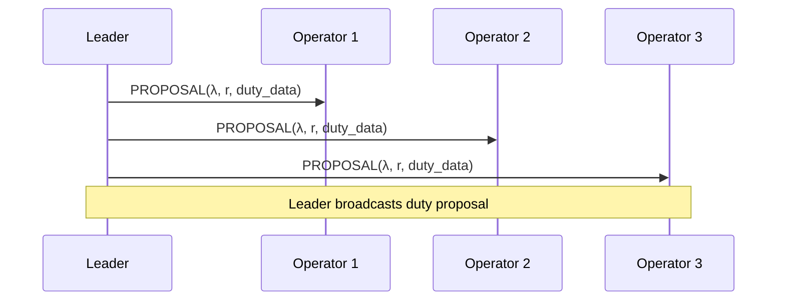
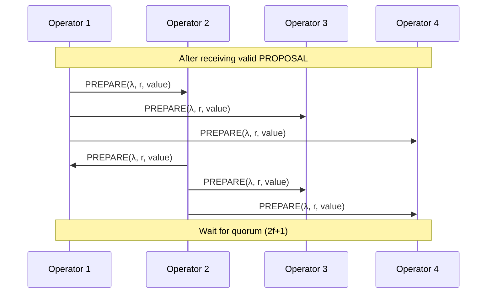
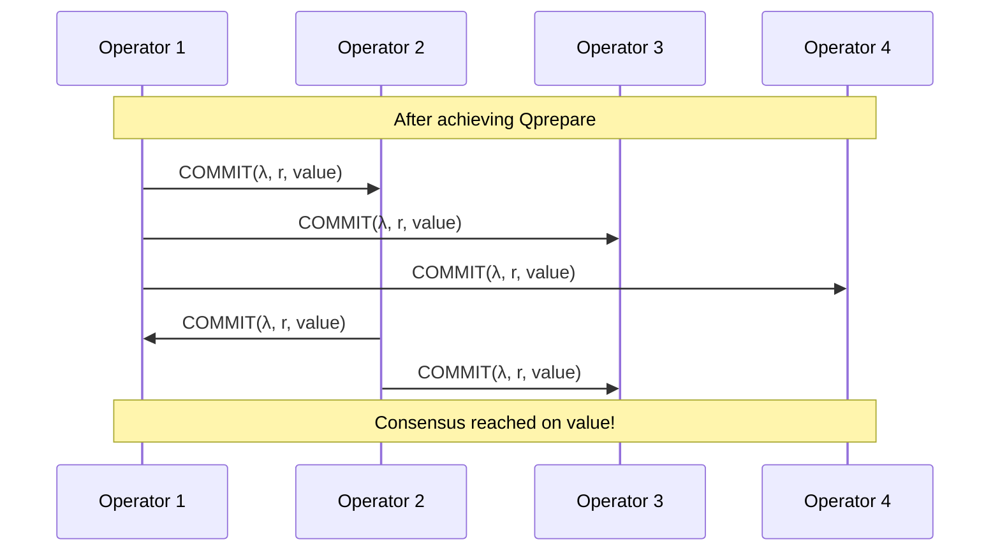
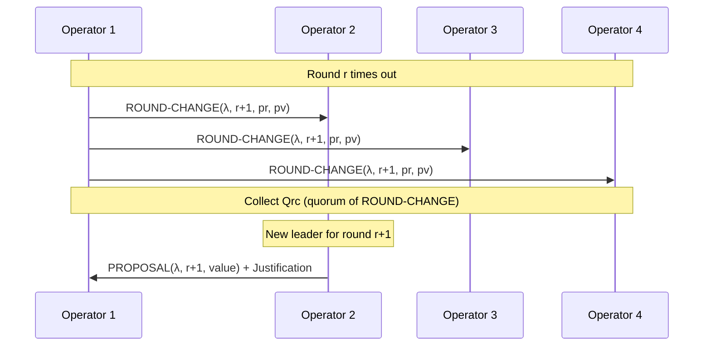

SSV uses **QBFT** (QBFT Byzantine Fault Tolerance), a variant of Istanbul BFT, to coordinate distributed validators. This consensus mechanism ensures that operator nodes agree on which beacon chain duties to sign, even when some operators are faulty, offline, or malicious.

## Why Consensus Matters

In a distributed validator system, multiple operators hold shares of a validator key. Before signing any beacon chain duty (attestation, block proposal, etc.), operators must reach **Byzantine agreement** on:

1. **What data to sign** - The specific attestation, block, or sync committee message
2. **When to sign it** - Ensuring duties execute in the correct slot
3. **That enough operators agree** - Meeting the threshold for valid signatures

Without consensus, operators could sign conflicting data, leading to slashing. QBFT provides the coordination layer that makes distributed validators safe.

<Info>
QBFT ensures consensus can be reached by a committee of `n` validator nodes while tolerating `f` faulty nodes, defined by **n ≥ 3f + 1**.
</Info>

## QBFT Fundamentals

### Byzantine Fault Tolerance

Byzantine Fault Tolerance addresses the [Byzantine Generals Problem](https://en.wikipedia.org/wiki/Byzantine_fault): how to reach consensus when some participants may fail, crash, or act maliciously.

**QBFT Properties:**

- **Safety**: Never produces conflicting decisions (prevents slashing)
- **Liveness**: Eventually makes progress (duties execute)
- **Byzantine Resilience**: Tolerates up to `f` faulty operators out of `n` total

| Cluster Size | Faulty Tolerated | Safety Threshold | Liveness Threshold |
|--------------|------------------|------------------|-------------------|
| 4 operators  | 1                | 2 signatures     | 3 online          |
| 7 operators  | 2                | 3 signatures     | 5 online          |
| 10 operators | 3                | 4 signatures     | 7 online          |

### Consensus Terminology

<Card title="Key Terms" icon="book-open">
- **Instance (λ)**: A single consensus run for one duty
- **Height**: Monotonically increasing instance counter (equivalent to beacon slot)
- **Round (r)**: Iteration within an instance; starts at 1, increments on timeout
- **Leader**: Operator responsible for proposing data in a given round
- **Quorum (Q)**: Threshold of messages needed for consensus (2f+1)
- **Committee**: Group of n operators managing a validator
</Card>

## Consensus Phases

QBFT consensus proceeds through three main phases: **PROPOSAL**, **PREPARE**, and **COMMIT**. A fourth phase, **ROUND-CHANGE**, handles timeouts and leader failures.

### Phase 1: PROPOSAL



**Leader Selection:**
- Deterministic: `leader = (λ + r) mod n`
- All operators know who should lead each round
- Invalid proposals from non-leaders are rejected

**Proposal Message:**
```
<PROPOSAL, λ, r, inputValue>
```

Where:
- `λ` (lambda): Instance height
- `r`: Current round
- `inputValue`: Beacon chain duty data (attestation, block, etc.)

**Validation:**
1. Verify the sender is the correct leader for this round
2. Validate the duty data against beacon chain state
3. Check for slashing conditions (no conflicting signatures)
4. Verify the proposal is for the expected slot and role

Implementation: `protocol/v2/qbft/instance/proposal.go`

### Phase 2: PREPARE



**PREPARE Message:**
```
<PREPARE, λ, r, value>
```

**Purpose:**
- Operators broadcast their acceptance of the proposal
- Acts as a "pre-vote" before final commitment
- Prevents premature commitment to unvalidated data

**Quorum Achievement:**

Once an operator receives `2f+1` valid PREPARE messages (including its own), it has achieved **Qprepare**. This signals that a supermajority has accepted the proposed value.

<Note>
An operator can proceed to COMMIT upon receiving Qprepare, even without the original PROPOSAL. This optimization handles cases where the leader is slow but honest operators have already agreed.
</Note>

Implementation: `protocol/v2/qbft/instance/instance.go:150`

### Phase 3: COMMIT



**COMMIT Message:**
```
<COMMIT, λ, r, value>
```

**Finalization:**

When an operator receives `2f+1` valid COMMIT messages (**Qcommit**), consensus is **decided**:

1. The operator stops the round timer
2. Marks the instance as decided
3. Proceeds to post-consensus (partial signature exchange)
4. The decided value becomes immutable for this instance

**Decided Storage:**

Decided messages are persisted in `ibft/storage/` to ensure:
- Operators don't re-run consensus for the same duty
- Historical decisions can be retrieved for sync protocols
- Slashing protection databases are updated

Implementation: `protocol/v2/qbft/controller/decided.go`

### Phase 4: ROUND-CHANGE

Round changes handle scenarios where consensus stalls due to:
- Leader failure or network partition
- Slow or faulty leader
- Insufficient quorum in current round



**ROUND-CHANGE Message:**
```
<ROUND-CHANGE, λ, r+1, pr, pv>
```

Where:
- `pr`: Highest round where this operator received Qprepare (null if never)
- `pv`: The value from round `pr` (null if `pr` is null)

**Round Change Triggers:**

1. **Timeout**: Round timer expires without reaching Qcommit
2. **F+1 Round Changes**: Receiving `f+1` ROUND-CHANGE messages for higher rounds
3. **Leader Failure**: Detected through lack of valid PROPOSAL

**New Round Process:**

1. Operators broadcast ROUND-CHANGE messages
2. Wait for **Qrc** (quorum of `2f+1` ROUND-CHANGE messages)
3. New leader justifies the PROPOSAL:
   - If any operator has `pr ≠ null`, propose the `pv` from the highest `pr`
   - Otherwise, propose fresh duty data from the beacon node
4. New leader broadcasts justified PROPOSAL
5. Consensus proceeds normally in the new round

**Justification:**

Round-change justification prevents equivocation:
- Proves that the new proposal is based on valid prior agreement
- Operators verify the justification before accepting the proposal
- Ensures safety across round transitions

<Card title="Annotated IBFT Paper" icon="file-pdf">
For detailed round-change mechanics and formal proofs, see the [IBFT Annotated Paper](https://github.com/ssvlabs/ssv/blob/main/ibft/IBFT.md) in the SSV repository.
</Card>

Implementation: `protocol/v2/qbft/instance/instance.go` (round change logic)

## Consensus Flow Diagrams

### Normal Case (Single Round)

In the optimal scenario:
1. Leader proposes valid data
2. All honest operators prepare
3. All honest operators commit
4. Consensus decided in round 1

**Time Complexity:** O(1) round, ~1-2 seconds

### Round Change Scenario

When the leader fails or is slow:
1. Round timeout triggers ROUND-CHANGE
2. Operators achieve Qrc
3. New leader elected
4. Justified proposal in round 2
5. Consensus decided

**Time Complexity:** O(r) rounds, scales with number of leader failures

## Implementation Details

### QBFT Controller

The `Controller` (`protocol/v2/qbft/controller/controller.go`) orchestrates consensus instances:

```go
type Controller struct {
    Identifier      []byte                    // Validator or committee ID
    Height          specqbft.Height           // Current consensus height
    StoredInstances InstanceContainer         // Recent instance history
    CommitteeMember *spectypes.CommitteeMember // Operator info
    OperatorSigner  ssvtypes.OperatorSigner   // For signing messages
}
```

**Key Responsibilities:**
- Starting new consensus instances for each duty
- Managing instance lifecycle (active, decided, historical)
- Processing incoming consensus messages
- Triggering timeouts and round changes

### Instance Management

Each duty creates a new QBFT instance (`protocol/v2/qbft/instance/instance.go`):

```go
type Instance struct {
    State *State                 // Current round, accepted proposals
    config qbft.IConfig          // Quorum thresholds, timeouts
    committeeMember *CommitteeMember
}
```

**Instance State:**
- `Height`: Beacon slot / consensus instance number
- `Round`: Current round within the instance
- `ProposalAcceptedForCurrentRound`: Accepted proposal (if any)
- `LastPreparedRound` & `LastPreparedValue`: Highest round with Qprepare

### Message Processing

Message flow through the stack:

1. **P2P Layer** (`network/p2p/p2p_pubsub.go`): Receives messages on GossipSub topics
2. **Message Router**: Routes to appropriate validator/committee
3. **Runner** (`protocol/v2/ssv/runner/runner.go`): Decodes and validates structure
4. **QBFT Controller**: Delivers to the correct instance
5. **Instance**: Processes according to current state and message type

### Timing and Timeouts

Timer configuration (`protocol/v2/qbft/controller/timer.go`):

- **Base Timeout**: Configurable per network (e.g., 2 seconds for mainnet)
- **Exponential Backoff**: `timeout(r) = base_timeout * 2^(r-1)`
- **Round 1**: 2s
- **Round 2**: 4s
- **Round 3**: 8s
- **Round 4**: 16s

This ensures liveness while adapting to network conditions.

## Security Properties

### Slashing Prevention

QBFT guarantees **at most one decided value per instance**:

- Byzantine operators cannot cause conflicting commitments
- Double-signing is impossible when `2f+1` operators are honest
- Slashing protection databases provide additional safety

**Validator Safety:**
- Each operator independently validates against slashing conditions
- Pre-consensus checks prevent conflicting partial signatures
- Consensus ensures all operators sign the same data

### Network Resilience

QBFT handles various failure scenarios:

| Failure Mode | QBFT Response |
|--------------|---------------|
| Leader crash | Round change to new leader |
| Network partition | Progress when partition heals |
| Byzantine messages | Ignored or scored negatively |
| Delayed messages | Round change, eventual progress |

### Liveness Guarantees

**Assumptions for Liveness:**
1. At most `f` operators are Byzantine
2. Network eventually delivers messages (asynchronous model)
3. There exists a synchronous period long enough for message exchange

**Guaranteed Progress:**
- Liveness holds even with changing network conditions
- Round changes ensure eventual leader rotation
- No deadlock scenarios with honest majority

## Performance Characteristics

### Message Complexity

Per consensus instance with `n` operators:

- **PROPOSAL**: O(n) messages (1 leader to n operators)
- **PREPARE**: O(n²) messages (n operators broadcast to n)
- **COMMIT**: O(n²) messages (n operators broadcast to n)

**Total**: O(n²) messages per instance in the best case (single round)

### Latency

Typical consensus latency on mainnet (4 operators):

- **Best case**: 1-2 seconds (single round, low network latency)
- **Average case**: 2-4 seconds (including network jitter)
- **Worst case**: Scales with round changes (exponential backoff)

### Optimizations

**Message Aggregation:**
- PREPARE and COMMIT messages can be aggregated (multiple signers)
- Reduces message count in implementations (not yet in SSV)

**Pipelining:**
- New instances can start before previous ones finish
- Duty queue processes multiple duties concurrently

Implementation: `protocol/v2/ssv/queue/` for concurrent duty processing

## Research Foundations

QBFT is based on rigorous academic research:

<Card title="Istanbul BFT Paper" icon="graduation-cap">
**[The Istanbul BFT Consensus Algorithm](https://arxiv.org/pdf/2002.03613.pdf)**

Formal specification and proofs for:
- Safety (agreement on single value)
- Liveness (eventual termination)
- Byzantine resilience (up to f faults)
</Card>

**Related Work:**
- [EIP-650: Istanbul Byzantine Fault Tolerance](https://github.com/ethereum/EIPs/issues/650) - Original Ethereum proposal
- [PBFT Paper](http://pmg.csail.mit.edu/papers/osdi99.pdf) - Castro & Liskov's Practical Byzantine Fault Tolerance
- [HotStuff](https://arxiv.org/pdf/1803.05069.pdf) - Linear consensus protocol

## Next Steps

<CardGroup cols={2}>
  <Card title="Network Topology" icon="network-wired" href="/concepts/network-topology">
    Learn how consensus messages propagate through the P2P network
  </Card>
  <Card title="Validator Duties" icon="clipboard-check" href="/concepts/duties">
    Understand what data operators are reaching consensus on
  </Card>
</CardGroup>
