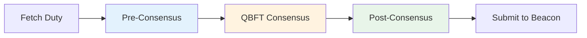
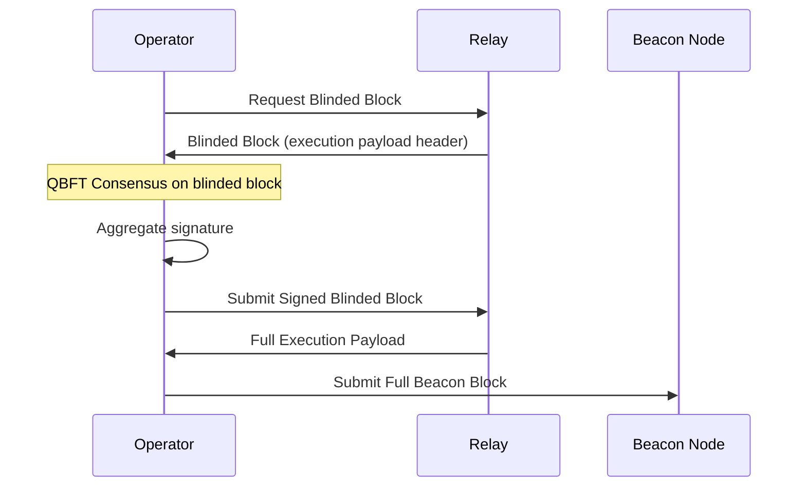

Validator duties are the core responsibilities that Ethereum validators must perform to secure the beacon chain and earn rewards. In SSV, distributed operators coordinate to execute these duties collectively using threshold signatures and Byzantine consensus.

## Overview

Ethereum validators have four main duty types:

1. **Attestation**: Vote on beacon chain state and finality (every epoch)
2. **Block Proposal**: Propose new beacon blocks (occasional, based on assignment)
3. **Sync Committee**: Facilitate light client synchronization (periodic, 27 hours)
4. **Aggregation**: Aggregate attestations from other validators (subset of validators)

<Info>
SSV operators execute these duties in a **distributed manner**: they reach consensus on what to sign, generate partial signatures with key shares, and reconstruct full signatures through threshold aggregation.
</Info>

## Duty Execution Flow

All validator duties in SSV follow a three-phase pattern:



### Phase 1: Pre-Consensus

**Purpose**: Operators independently prepare duty data and create partial signatures

**Steps:**

1. **Duty Fetcher**: Query beacon node for assigned duties in upcoming slots
   - Implementation: `operator/duties/` duty scheduler
   - Duties fetched 2 epochs in advance

2. **Data Preparation**: Each operator independently constructs duty data
   - For attestations: Attestation data (beacon block root, source, target)
   - For proposals: Beacon block (via block builder or local construction)
   - For sync committee: Beacon block root for the slot

3. **Partial Signature**: Sign duty data with validator key share
   - Uses BLS signature with operator's secret share
   - Implementation: `protocol/v2/ssv/runner/runner_signatures.go`

4. **Broadcast**: Send partial signature to other operators
   - Transmitted via `PartialSignatureMessages`
   - Uses GossipSub pubsub (subnet topic)

<Note>
Pre-consensus signatures are **not yet for the final duty**. They're for intermediate data that will be used to construct the consensus value.
</Note>

### Phase 2: QBFT Consensus

**Purpose**: Operators agree on exactly what duty data to sign

**Process:**

1. **Instance Creation**: Start QBFT instance for the duty (height = slot)
   - Controller: `protocol/v2/qbft/controller/controller.go`
   
2. **Proposal**: Leader proposes the duty data (attestation, block, etc.)
   - Validates against beacon chain state
   - Checks for slashing conditions

3. **Consensus Phases**: PROPOSAL → PREPARE → COMMIT
   - See [Consensus](/concepts/consensus) for detailed explanation

4. **Decision**: Once `2f+1` operators commit, duty data is decided
   - Decided value is immutable
   - Triggers post-consensus phase

**Consensus Output**: Agreed-upon duty data that all operators will sign

### Phase 3: Post-Consensus

**Purpose**: Reconstruct full signature and submit to beacon chain

**Steps:**

1. **Partial Signature Exchange**: Operators share partial signatures on decided data
   - Each operator signs the exact data decided in consensus
   - Broadcasts `PartialSignatureMessages` to committee

2. **Signature Aggregation**: Collect and combine partial signatures
   - Need `2f+1` valid partial signatures (threshold)
   - BLS signature aggregation: `agg_sig = Σ(partial_sigs)`
   - Implementation: `protocol/v2/ssv/runner/runner_signatures.go:70`

3. **Validation**: Verify reconstructed signature
   - Check against validator public key
   - Ensure it matches beacon chain expectations

4. **Submission**: Submit duty to beacon node
   - Attestations → `/eth/v1/beacon/pool/attestations`
   - Blocks → `/eth/v1/beacon/blocks`
   - Sync committee → `/eth/v1/beacon/pool/sync_committees`

**Result**: Validator duty successfully executed and submitted to Ethereum

## Attestation Duties

Attestations are votes on the beacon chain state, performed **once per epoch** by each validator.

### Attestation Structure

```go
type AttestationData struct {
    Slot            Slot           // When attestation created
    Index           CommitteeIndex // Committee assignment
    BeaconBlockRoot Root           // Head of chain
    Source          Checkpoint     // Justified checkpoint
    Target          Checkpoint     // Epoch boundary block
}
```

**Key Fields:**

- **BeaconBlockRoot**: LMD GHOST head vote
- **Source**: Last justified checkpoint (FFG Casper)
- **Target**: Current epoch boundary (FFG Casper)

### Execution Process

**1. Duty Assignment**

Validators are assigned to **committees** for specific slots:

```
Committee assignment = hash(validator_index, slot, domain) mod committees_per_slot
```

**2. Pre-Consensus (Attestation)**

Operators independently:
- Fetch attestation data from beacon node
- Determine correct head, source, target
- Create partial signature on `AttestationData`
- Broadcast to committee

**3. Consensus**

- Operators propose and agree on `AttestationData`
- Validates:
  - Slot matches assignment
  - Source/target are reasonable (not slashable)
  - Beacon block root exists

**4. Post-Consensus**

- Exchange partial signatures on decided `AttestationData`
- Aggregate into full `Attestation.Signature`
- Submit to beacon node

**Timing Constraints:**

- **Deadline**: 1/3 through the slot (4 seconds on mainnet)
- **SSV Buffer**: Aim to complete 2-3 seconds into slot
- **Late Attestations**: Still accepted but lower rewards

Implementation: `protocol/v2/ssv/runner/aggregator.go` (though attestations use committee runner in practice)

### Slashing Conditions

SSV prevents two slashable attestation scenarios:

**1. Double Vote**: Attesting to two different beacon blocks in the same epoch

```
❌ Slashable:
  Attestation 1: epoch 100, target A
  Attestation 2: epoch 100, target B  (same epoch, different target)
```

**Protection**: Slashing database tracks all attestations per epoch per validator

**2. Surround Vote**: Attestation surrounds or is surrounded by previous attestation

```
❌ Slashable:
  Attestation 1: source epoch 90, target epoch 100
  Attestation 2: source epoch 89, target epoch 101  (surrounds)
```

**Protection**: Validate source/target against historical attestations

Implementation: Slashing protection in `beacon/` or Web3Signer database

## Block Proposal Duties

Validators are **occasionally assigned** to propose beacon blocks, typically ~1-2 times per day per validator.

### Block Structure

A beacon block contains:

```go
type BeaconBlock struct {
    Slot          Slot
    ProposerIndex ValidatorIndex
    ParentRoot    Root
    StateRoot     Root
    Body          BeaconBlockBody {
        RANDAOReveal       BLSSignature
        Eth1Data           Eth1Data
        Graffiti           [32]byte
        ProposerSlashings  []ProposerSlashing
        AttesterSlashings  []AttesterSlashing
        Attestations       []Attestation
        Deposits           []Deposit
        VoluntaryExits     []SignedVoluntaryExit
        ExecutionPayload   ExecutionPayload  // Post-merge
    }
}
```

### Execution Process

**1. Duty Assignment**

Proposers are assigned deterministically:

```
proposer_index = hash(seed, slot) mod active_validators
```

**2. Pre-Consensus (RANDAO)**

RANDAO reveal is signed in pre-consensus:

```go
randao_reveal = BLS_Sign(
    key_share,
    hash_tree_root(epoch),
    DOMAIN_RANDAO
)
```

- Each operator creates partial RANDAO signature
- Exchanged before consensus on full block

**3. Consensus**

Operators propose and agree on **full beacon block**:

- **Block Construction**: Via builder API or local construction
  - **MEV-Boost**: Request blinded block from relay
  - **Local**: Build block with txs from execution client
  
- **Validation**:
  - RANDAO reveal is valid
  - Block contents valid (attestations, slashings, etc.)
  - Execution payload valid (post-merge)
  - Not slashable (no double proposal for same slot)

**4. Post-Consensus**

- Exchange partial signatures on decided block
- Aggregate into `BeaconBlock.Signature`
- Submit to beacon node

**Timing:**

- **Deadline**: Start of slot (12 seconds)
- **SSV Target**: Complete in first 2-4 seconds
- **Late Blocks**: Orphaned and lose rewards

### Blinded Block Flow (MEV)

For MEV-Boost integration:



**Benefits:**
- Validators don't see transaction contents (prevent frontrunning)
- Relays provide MEV-optimized blocks
- Higher validator rewards

Implementation: `protocol/v2/blockchain/beacon/blind/` for blinded block support

### Slashing Conditions

**Proposal Slashing**: Proposing two different blocks in the same slot

```
❌ Slashable:
  Block 1: slot 1000, body A
  Block 2: slot 1000, body B  (same slot, different content)
```

**Protection**: 
- Slashing database tracks all proposed slots
- QBFT consensus ensures all operators sign the same block
- Double proposal impossible with honest majority

## Sync Committee Duties

Sync committees are **subsets of validators** (512 on mainnet) that serve for ~27 hours to help light clients follow the chain.

### Assignment

Validators are randomly selected for sync committee duty:

- **Duration**: 256 epochs (~27 hours)
- **Size**: 512 validators
- **Frequency**: Each validator serves ~24 times per year (on average)

**Checking Assignment:**

```bash
curl $BEACON_NODE/eth/v1/beacon/states/head/sync_committees?epoch=$EPOCH
```

### Sync Committee Messages

Every slot during assignment, sync committee members attest to the head:

```go
type SyncCommitteeMessage struct {
    Slot            Slot
    BeaconBlockRoot Root  // Head block root
    ValidatorIndex  ValidatorIndex
    Signature       BLSSignature
}
```

### Execution Process

**1. Pre-Consensus**

- Operators determine beacon block root for the slot
- Create partial signature on `BeaconBlockRoot`

**2. Consensus**

- Agree on the correct beacon block root
- Validates slot and block root existence

**3. Post-Consensus**

- Exchange partial signatures
- Aggregate into `SyncCommitteeMessage.Signature`
- Submit to beacon node

**Timing:**

- **Deadline**: 1/3 through slot (4 seconds)
- **Frequency**: Every slot for 256 epochs

### Sync Committee Contribution

Sync committee members also participate in **aggregation**:

```go
type SyncCommitteeContribution struct {
    Slot              Slot
    BeaconBlockRoot   Root
    SubcommitteeIndex uint64
    AggregationBits   Bitvector[128]
    Signature         BLSSignature  // Aggregated from 128 members
}
```

**Aggregator Selection:**

Similar to attestation aggregation, a subset of sync committee members aggregate signatures from their subcommittee (512 validators / 4 subnets = 128 per subnet).

Implementation: `protocol/v2/ssv/runner/sync_committee_contribution.go`

## Aggregation Duties

Aggregators combine attestations from their committee to reduce network overhead.

### Aggregator Selection

Not all validators aggregate; selection is random:

```go
slot_signature = BLS_Sign(key, slot, DOMAIN_SELECTION_PROOF)
modulo = hash(slot_signature) mod VALIDATORS_PER_COMMITTEE

is_aggregator = modulo < TARGET_AGGREGATORS_PER_COMMITTEE
```

**Probability**: ~1/16 validators per committee become aggregators

### Execution Process

**1. Selection Proof (Pre-Consensus)**

- Sign `slot` with `DOMAIN_SELECTION_PROOF`
- Partial signatures exchanged
- Aggregated selection proof determines eligibility

**2. Aggregate Attestations**

If selected as aggregator:

- Collect attestations from committee members via beacon node
- Combine into `AggregateAttestation`:
  ```go
  type AggregateAttestation struct {
      AggregationBits Bitlist[MAX_VALIDATORS_PER_COMMITTEE]
      Data            AttestationData
      Signature       BLSSignature  // Aggregated
  }
  ```

**3. Consensus**

Operators agree on the aggregate attestation to submit

**4. Post-Consensus**

- Sign aggregate attestation
- Submit `SignedAggregateAndProof` to beacon node

**Timing:**

- **Deadline**: 2/3 through slot (8 seconds)
- **After Individual Attestations**: Wait for attestations to propagate

Implementation: `protocol/v2/ssv/runner/aggregator.go`

## Voluntary Exit

Validators can voluntarily exit the beacon chain to withdraw their stake.

### Exit Process

**1. Exit Message Construction**

```go
type VoluntaryExit struct {
    Epoch          Epoch  // When to exit
    ValidatorIndex ValidatorIndex
}
```

**2. Pre-Consensus**

- Operators agree on exit epoch
- Create partial signatures on `VoluntaryExit`

**3. Consensus**

- QBFT agrees on the exact exit message
- Validates:
  - Validator is active
  - Minimum time served (256 epochs)
  - Exit epoch is reasonable

**4. Post-Consensus**

- Aggregate signatures
- Submit `SignedVoluntaryExit` to beacon node

**Irreversibility:**

Once submitted, voluntary exits **cannot be reversed**. The validator will:
- Stop having duties after the exit epoch
- Enter exit queue (churn limit)
- Become withdrawable after ~27 hours

Implementation: `protocol/v2/ssv/runner/voluntary_exit.go`

## Validator Registration (MEV)

For MEV-Boost, validators register their preferred fee recipient and relay preferences.

### Registration Message

```go
type ValidatorRegistration struct {
    FeeRecipient ExecutionAddress
    GasLimit     uint64
    Timestamp    uint64
    PubKey       BLSPubkey
}
```

**Purpose**: Tell relays where to send MEV rewards

### Execution

**Pre-Consensus**: Operators agree on fee recipient and gas limit

**Consensus**: Agree on registration data

**Post-Consensus**: 
- Aggregate signatures on registration
- Submit to MEV relay(s)

**Frequency**: Updated periodically or when fee recipient changes

Implementation: `protocol/v2/ssv/runner/validator_registration.go`

## Duty Scheduling and Queueing

### Duty Scheduler

The duty scheduler (`operator/duties/`) fetches duties in advance:

**Lookahead:**
- Fetch duties for next 2 epochs
- Store in duty store (`operator/duties/dutystore/`)

**Types Fetched:**
- Attestation duties (every epoch for all validators)
- Proposal duties (rare, fetched per epoch)
- Sync committee duties (long-running, 256 epochs)

### Duty Queue

Duties are queued for execution (`protocol/v2/ssv/queue/`):

**Priority:**
- Proposals: Highest priority (tight timing)
- Attestations: High priority
- Aggregations: Medium priority (after attestations)
- Sync committee: Normal priority

**Concurrency:**
- Multiple duties processed in parallel
- Per-validator locking prevents conflicts
- Different duty types use separate workers

### Timing and Slots

Slot timing on mainnet:

```
Slot duration: 12 seconds
Epoch: 32 slots = 384 seconds (~6.4 minutes)

Slot timeline:
├─ 0s: Slot start
├─ 4s: Attestation deadline (1/3 slot)
├─ 8s: Aggregate deadline (2/3 slot)
└─ 12s: Next slot starts
```

**SSV Execution Targets:**

- **Attestations**: Complete by 3 seconds
- **Proposals**: Complete by 2 seconds
- **Sync Committee**: Complete by 3 seconds
- **Aggregations**: Complete by 7 seconds

This provides buffer for network propagation and inclusion.

## Error Handling

### Missed Duties

If consensus fails or times out:

- **Log Error**: Duty tracer tracks failures
- **Penalties**: Validator suffers inactivity leak (small)
- **No Slashing**: Missed duties are not slashable

**Common Causes:**
- Network partition
- Insufficient online operators (`< 2f+1`)
- Byzantine operators disrupting consensus

### Invalid Duties

If beacon node returns invalid duty data:

- **Reject in Consensus**: Operators vote against invalid proposals
- **Round Change**: Switch to new leader
- **Alternative Source**: Query backup beacon nodes

### Slashing Events

If slashing protection detects conflict:

- **Abort Duty**: Stop processing immediately
- **Alert Operator**: Log critical error
- **Investigate**: Manual intervention required

<Card title="Slashing Protection" icon="shield-halved">
SSV's multi-layered slashing protection:

1. **Per-Operator**: Each operator maintains slashing DB
2. **Consensus-Level**: QBFT prevents conflicting decisions
3. **Remote Signing**: Web3Signer provides additional checks
4. **Doppelganger**: Detect if validator is running elsewhere
</Card>

## Performance Metrics

### Duty Success Rates

**Expected Performance:**

- **Attestations**: >99% success rate
- **Proposals**: >99% success rate
- **Sync Committee**: >99% success rate
- **Aggregations**: >98% success rate

**Monitoring:**

- Duty tracer: `operator/dutytracer/` tracks all duty outcomes
- Metrics exported to Prometheus
- Dashboards show per-validator success rates

### Timing Analysis

**Consensus Latency (4-operator cluster):**

- **P50**: 1.5 seconds
- **P95**: 3 seconds
- **P99**: 5 seconds (includes round changes)

**End-to-End Duty Latency:**

- **Pre-consensus**: 0.5-1 second
- **Consensus**: 1.5-3 seconds
- **Post-consensus**: 0.5-1 second
- **Total**: 2.5-5 seconds

## Implementation Reference

| Duty Type | Runner File |
|-----------|-------------|
| Attestation | `protocol/v2/ssv/runner/committee.go` |
| Proposal | `protocol/v2/ssv/runner/proposer.go` |
| Aggregation | `protocol/v2/ssv/runner/aggregator.go` |
| Sync Committee | `protocol/v2/ssv/runner/sync_committee_contribution.go` |
| Voluntary Exit | `protocol/v2/ssv/runner/voluntary_exit.go` |
| Validator Registration | `protocol/v2/ssv/runner/validator_registration.go` |

**Duty Management:**

| Component | File Path |
|-----------|-----------|
| Duty Scheduler | `operator/duties/` |
| Duty Store | `operator/duties/dutystore/` |
| Duty Queue | `protocol/v2/ssv/queue/` |
| Duty Tracer | `operator/dutytracer/` |

## Next Steps

<CardGroup cols={2}>
  <Card title="Secret Sharing" icon="key" href="/concepts/secret-sharing">
    Understand how validator keys are split across operators
  </Card>
  <Card title="Consensus" icon="handshake" href="/concepts/consensus">
    Learn the QBFT consensus that coordinates duty execution
  </Card>
</CardGroup>
