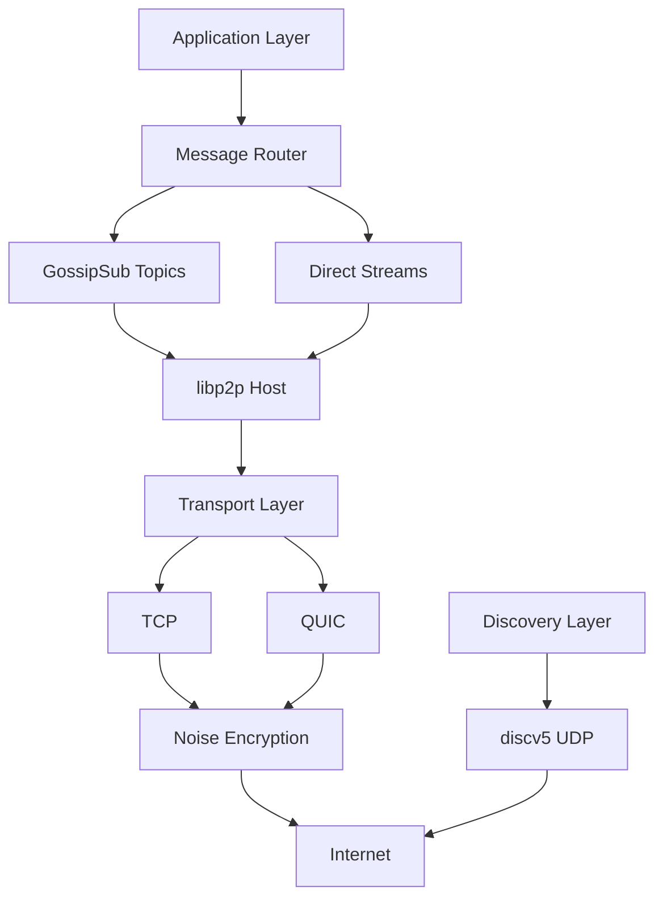
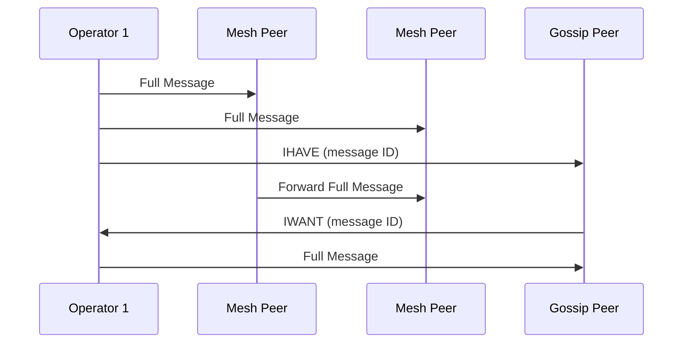

SSV Network is a permissionless peer-to-peer (P2P) network where operator nodes communicate to execute distributed validator duties. The networking layer handles node discovery, message routing, and propagation of consensus messages across thousands of operators worldwide.

## Architecture Overview

SSV's networking stack is built on **libp2p**, a modular P2P framework used by protocols like Ethereum, IPFS, and Filecoin. The architecture consists of several key layers:



<Card title="Networking Stack" icon="layer-group">
- **Transport**: TCP (default port 12001) and UDP (default port 13001)
- **Security**: Noise protocol for encrypted channels
- **Multiplexing**: yamux for multiple protocol streams
- **Discovery**: discv5 for peer discovery
- **Messaging**: GossipSub v1.1 for pubsub, streams for request/response
</Card>

## Transport Layer

### Secure Transport

All SSV network communication is encrypted using the [Noise Protocol](https://noiseprotocol.org/):

- **Handshake**: XX pattern provides mutual authentication
- **Encryption**: ChaCha20-Poly1305 authenticated encryption
- **Forward Secrecy**: New session keys for each connection
- **Identity Verification**: Based on libp2p peer IDs

Implementation: `go-libp2p-noise` library

### Connection Multiplexing

**yamux** (Yet Another Multiplexer) enables multiple logical streams over a single TCP connection:

- Operators can run consensus, sync, and other protocols simultaneously
- Reduces connection overhead and NAT traversal complexity
- Flow control prevents any single stream from monopolizing bandwidth

**Benefits:**
- Open one TCP connection per peer, not per protocol
- Efficient resource usage for operators with hundreds of validators
- Better performance in restricted network environments

## Peer Discovery

### discv5 Overview

SSV uses **discv5** (Discovery v5), Ethereum's node discovery protocol, for finding and connecting to other operators:

<Info>
discv5 is a standalone UDP-based protocol that maintains a Kademlia-style DHT (Distributed Hash Table) for storing and discovering peer records (ENRs).
</Info>

**Key Features:**
- **DHT Routing**: Kademlia-based peer organization by XOR distance
- **ENR Storage**: Ethereum Node Records contain peer metadata
- **Topic Discovery**: Find peers by subnet subscriptions
- **Security**: Encrypted discovery queries prevent passive eavesdropping

Implementation: `network/discovery/dv5_service.go`

### Ethereum Node Records (ENR)

Each SSV operator publishes an ENR containing network metadata:

```go
ENR Structure:
- id: "v4" (identity scheme)
- secp256k1: Network public key (33 bytes)
- ip: IPv4 address (4 bytes)
- tcp: TCP port for libp2p (default 12001)
- udp: UDP port for discv5 (default 13001)
- type: Node type (1=operator, 2=exporter, 3=bootnode)
- oid: Operator ID (hash of operator public key)
- forkv: Network fork version
- subnets: Bitlist of subscribed subnets
```

**ENR Example:**
```
enr:-MS4QD...
  ip: 203.0.113.42
  tcp: 12001
  udp: 13001
  type: 1 (operator)
  oid: 0x7a8f3c...
  subnets: [1,0,1,0,0,1,...]
```

Implementation: `network/discovery/node_record.go`

### Bootnode Discovery

**Bootnodes** are public peers with static ENRs that help new operators join the network:

- **Role**: Provide initial peer list to newcomers
- **Configuration**: ENRs hardcoded in node configuration or provided via flags
- **Operation**: Only run discv5, no libp2p host (lightweight)

**Process:**
1. New operator starts with bootnode ENR(s)
2. Queries bootnode for random peers via discv5
3. Connects to discovered peers
4. Begins discovering more peers through the DHT

**Production Bootnodes:**
- Operated by SSV Labs and community members
- Distributed geographically for resilience
- Configured per network (mainnet, holesky, etc.)

### Subnet-based Discovery

SSV operators advertise which **subnets** they participate in via the `subnets` ENR field:

```
subnets: bitlist of length 128 (mainnet)
  [1, 0, 1, 0, 0, 1, 1, 0, ...]
   ^     ^           ^
   |     |           Subscribed to subnet 6
   |     Not subscribed to subnet 2
   Subscribed to subnet 0
```

**Discovery Strategy:**

1. Operator determines required subnets based on validators
2. Publishes subnet subscriptions in ENR
3. Searches DHT for peers with overlapping subnets
4. Prioritizes connecting to peers with common subnets

This ensures operators find peers managing the same validators, forming cohesive **committees**.

Implementation: `network/discovery/subnets.go`

## Subnets and Topics

### Subnet Architecture

To scale beyond tens of thousands of validators, SSV partitions the network into **128 subnets** (mainnet):

<Card title="Why Subnets?" icon="diagram-project">
**Problem**: Having one topic per validator creates O(validators) topics, which doesn't scale.

**Solution**: Hash validators to deterministic subnets, reusing topics across multiple validators.

**Benefit**: O(√validators) topics with balanced distribution.
</Card>

### Validator to Subnet Mapping

Deterministic hash-based mapping:

```
subnet_id = hash(validator_pubkey) % num_subnets
```

**Properties:**
- **Deterministic**: Same validator always maps to the same subnet
- **Uniform Distribution**: Hash function distributes validators evenly
- **Fixed Size**: 128 subnets on mainnet (configurable per network)

**Example:**
```
Validator: 0x89a4c3...
SHA256(0x89a4c3...) = 0x7f32...
0x7f32... % 128 = 47
→ Validator assigned to subnet 47
```

Implementation: `network/commons/subnets.go`

### GossipSub Topics

Each subnet corresponds to a **GossipSub topic** where consensus messages are broadcast:

**Topic Naming:**
```
bloxstaking.ssv.<subnet_id>
```

**Examples:**
- `bloxstaking.ssv.0` - Subnet 0 topic
- `bloxstaking.ssv.47` - Subnet 47 topic
- `bloxstaking.ssv.127` - Subnet 127 topic

**Committee Topics:**

For committee-based runners (DVT clusters), topics use committee IDs:

```
bloxstaking.ssv.committee.<committee_id>
```

### Topic Subscriptions

Operators subscribe to topics based on their validators:

1. **Query Validators**: Operator checks which validators it manages
2. **Determine Subnets**: Map each validator pubkey to subnet
3. **Subscribe**: Join corresponding GossipSub topics
4. **Update ENR**: Publish subnet subscriptions for discovery

**Dynamic Subscriptions:**
- When a validator is added, subscribe to its subnet topic
- When a validator is removed, unsubscribe if no other validators use that subnet
- Maintain minimum subnet subscriptions for network health

Implementation: `network/p2p/p2p_pubsub.go`

## Message Propagation

### GossipSub v1.1

SSV uses **GossipSub v1.1**, a pubsub protocol optimized for adversarial environments:

<Info>
GossipSub balances reliability, efficiency, and resilience by maintaining a mesh overlay for each topic and using gossip to disseminate messages quickly.
</Info>

**Core Concepts:**

**Mesh Peers:**
- Each operator maintains a mesh of 6-12 peers per topic (configurable)
- Full messages exchanged with mesh peers
- Provides redundancy and fast propagation

**Gossip Peers:**
- Peers outside the mesh receive metadata (message IDs) only
- Can request full messages if interested (IWANT/IHAVE protocol)
- Reduces bandwidth while maintaining awareness

**Message Flow:**



### Message Validation

Before relaying messages, operators perform **topic-level validation**:

**Validation Stages:**

1. **Structural Validation**: Verify protobuf encoding and required fields
2. **Signature Verification**: Check operator signatures on consensus messages
3. **Subnet Check**: Ensure message belongs to the topic
4. **Slashing Check**: Verify message won't cause slashable offense

**Validation Results:**

- `ACCEPT`: Valid message, propagate to mesh
- `REJECT`: Invalid message, penalize sender, don't relay
- `IGNORE`: Don't process or relay, but don't penalize sender

Implementation: Extended validators in `network/p2p/p2p_pubsub.go`

### Message Deduplication

**Message ID Function:**

GossipSub uses message IDs to deduplicate:

```go
msg_id = hash(signed_consensus_msg)
```

This content-based ID ensures:
- Same logical message from different peers has the same ID
- Duplicate messages are ignored automatically
- Reduces redundant processing and network traffic

**Message Cache:**
- Recent message IDs stored in LRU cache
- TTL-based expiration (typically 2-3 heartbeat intervals)
- Prevents replay of old messages

Implementation: Custom msgID function in `network/p2p/p2p_pubsub.go:426`

## Peer Scoring

### GossipSub Scoring

Peer scoring protects the network from malicious or misbehaving operators:

<Card title="Scoring Components" icon="star">
1. **Topic Participation**: Rewards active, useful peers
2. **Message Delivery**: Penalizes peers sending invalid messages
3. **Behavior**: Tracks grafts, prunes, and IWANT/IHAVE patterns
4. **Application-Specific**: Custom scoring based on consensus message validity
</Card>

**Score Thresholds:**

| Threshold | Value | Effect |
|-----------|-------|--------|
| Gossip Threshold | -4000 | Below this, no gossip sent to peer |
| Publish Threshold | -8000 | Below this, no messages accepted from peer |
| Graylist Threshold | -16000 | Below this, peer completely ignored |
| Accept PX Threshold | 100 | Above this, accept peer exchange (PX) |

### Consensus Scoring

Application-specific scoring based on **consensus message validation**:

**Scoring Events:**

- `Accept`: Valid consensus message (+5 to +10)
- `RejectLow`: Minor issue, late message (-10 to -20)
- `RejectMedium`: Wrong height or round (-50 to -100)
- `RejectHigh`: Invalid signature, slashable (-500 to -1000)

**Asynchronous Application:**
- Validation happens in duty processing (outside pubsub)
- Results reported via validator result channel
- Applied during pubsub heartbeat (every 1 second)

Implementation: `network/p2p/p2p_pubsub.go` (score functions)

### Connection Gating

**ConnectionGater** prevents connections from bad peers:

```go
type ConnectionGater interface {
    InterceptPeerDial(peer.ID) bool      // Block outbound dials
    InterceptAddrDial(peer.ID, ma.Multiaddr) bool
    InterceptAccept(network.ConnMultiaddrs) bool // Block inbound
    InterceptSecured(network.Direction, peer.ID, network.ConnMultiaddrs) bool
}
```

**Gating Rules:**
- Block peers with score below graylist threshold
- IP-based rate limiting (max connections per IP)
- Prevent reconnection attempts from pruned peers (backoff)

Implementation: `network/commons/gater.go`

## Sync Protocols

For historical data and catching up, SSV uses **stream-based sync protocols** (not pubsub):

### 1. Highest Decided

**Protocol ID:** `/ssv/sync/decided/highest/0.0.1`

**Purpose:** Query the highest decided consensus message for a validator

**Use Case:** New operator joining a validator needs to know the latest state

**Request:**
```json
{
  "protocol": "/ssv/sync/decided/highest/0.0.1",
  "identifier": "0x89a4c3..."  // Validator pubkey
}
```

**Response:**
```json
{
  "protocol": "/ssv/sync/decided/highest/0.0.1",
  "identifier": "0x89a4c3...",
  "statusCode": 0,
  "data": [{
    "message": { "height": 7943, "round": 1, ... },
    "signature": "0x...",
    "signer_ids": [1, 2, 4]
  }]
}
```

### 2. Decided History

**Protocol ID:** `/ssv/sync/decided/history/0.0.1`

**Purpose:** Query historical decided messages in a range

**Use Case:** Exporter nodes collecting network data, audit logs

**Request:**
```json
{
  "protocol": "/ssv/sync/decided/history/0.0.1",
  "identifier": "0x89a4c3...",
  "params": ["1200", "1225"]  // Height range
}
```

**Response:** Array of decided messages for heights 1200-1225

<Note>
History sync is **optional**. Only full nodes and exporters run this protocol. Standard operators don't save historical decided messages to conserve storage.
</Note>

Implementation: Sync protocols in `protocol/v2/sync/`

## Network Security

### Sybil Resistance

**Mechanisms:**

1. **Operator Registration**: Operators must register on-chain (stake SSV tokens)
2. **Reputation Scoring**: New peers start with neutral score, build reputation over time
3. **Connection Limits**: Max peers per operator prevents resource exhaustion
4. **Subnet Diversity**: Validators distributed across subnets limits Sybil impact

### Eclipse Attack Prevention

**Strategies:**

- **Diverse Discovery**: Multiple bootnodes, DHT random walk
- **Subnet-based Routing**: Ensures connection to committee members
- **Peer Exchange (PX)**: Learn about new peers from trusted connections
- **Outbound Connection Preference**: Maintain ratio of outbound to inbound connections

### DDoS Mitigation

**Defenses:**

1. **Rate Limiting**: Max messages per peer per second
2. **Connection Limits**: Max total connections, max per IP
3. **Early Validation**: Reject malformed messages at transport layer
4. **Backoff**: Exponential backoff for failing peers
5. **Graylist**: Completely ignore peers below threshold

## Performance Characteristics

### Latency

**Message Propagation:**

- **Intra-subnet**: 100-500ms (mesh peer to mesh peer)
- **Cross-subnet**: N/A (validators don't share topics)
- **Consensus**: 1-2 seconds (includes validation + propagation)

**Factors:**
- Geographic distribution of operators
- Network congestion and packet loss
- Peer mesh connectivity

### Bandwidth

**Per Operator Estimates (128 subnets, 10,000 validators):**

- **Consensus Messages**: ~50-200 KB/s per subnet (depends on validator count)
- **Gossip Overhead**: ~20-50% additional (IHAVE/IWANT/PX)
- **Discovery**: ~5-10 KB/s (discv5 queries, ENR updates)

**Total**: ~100-500 KB/s for an operator with moderate validator load

### Scalability

**Current Limits:**

- **Subnets**: 128 (mainnet), can be increased in future forks
- **Validators per Subnet**: ~78 (10,000 / 128)
- **Message Rate**: Scales with validator count per subnet

**Future Optimizations:**

- Message aggregation (combine PREPARE/COMMIT from multiple signers)
- Partial message propagation (only send deltas)
- Adaptive subnet sizing based on network growth

## Network Types

SSV supports different node types with varying responsibilities:

### Operator Node

- **Full consensus participation**: Runs QBFT for validators
- **Subnet subscriptions**: Subscribes to relevant validator subnets
- **Sync protocol**: Supports highest-decided sync
- **Storage**: Validator shares, latest decided messages
- **Ports**: TCP 12001, UDP 13001

### Exporter Node

- **Passive observation**: Listens to all subnets
- **No consensus**: Doesn't participate in QBFT
- **Full history**: Stores historical decided messages
- **Sync protocol**: Supports decided-history sync
- **Use Case**: Network monitoring, analytics, explorers

### Bootnode

- **Discovery only**: Runs discv5 UDP service
- **No libp2p**: Doesn't open TCP connections
- **Static ENR**: Publicly known, stable address
- **Lightweight**: Minimal resource requirements

## Implementation Reference

Key files for networking implementation:

| Component | File Path |
|-----------|-----------|
| P2P Host Setup | `network/p2p/p2p_setup.go` |
| GossipSub Config | `network/p2p/p2p_pubsub.go` |
| Discovery Service | `network/discovery/dv5_service.go` |
| ENR Management | `network/discovery/node_record.go` |
| Subnet Utils | `network/commons/subnets.go` |
| Connection Gater | `network/commons/gater.go` |
| Sync Protocols | `protocol/v2/sync/` |

## Next Steps

<CardGroup cols={2}>
  <Card title="Consensus Mechanism" icon="handshake" href="/concepts/consensus">
    Understand QBFT consensus running over this network
  </Card>
  <Card title="Validator Duties" icon="clipboard-check" href="/concepts/duties">
    Learn what messages are propagated through the network
  </Card>
</CardGroup>
