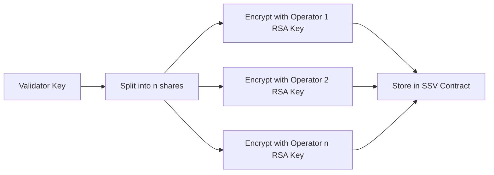

Secret Shared Validators (SSV) is the core innovation that enables distributed validator technology on Ethereum. By splitting validator keys across multiple operators using threshold cryptography, SSV creates a robust, fault-tolerant approach to validator key management.

## Overview

Traditional Ethereum validators operate with a single private key controlled by one entity. If that key is compromised, offline, or mismanaged, the validator faces slashing penalties or missed rewards. SSV solves this by distributing trust and operational responsibility across multiple independent operators.

<Info>
SSV uses an MPC (Multi-Party Computation) threshold scheme combined with Byzantine Fault Tolerant consensus to enable decentralized validator operations without any single point of failure.
</Info>

## How Secret Sharing Works

### Shamir's Secret Sharing

SSV implements threshold cryptography based on **Shamir's Secret Sharing Scheme**, a cryptographic method that divides a secret (the validator private key) into multiple shares distributed among operators.

<Card title="Threshold Signature Scheme" icon="key">
In an SSV cluster with `n` operators, a validator key is split into `n` shares where any `f+1` shares can reconstruct a valid signature, but `f` or fewer shares reveal no information about the private key.

The threshold is defined by: **n ≥ 3f + 1**

Where:
- `n` = total number of operators
- `f` = maximum number of faulty operators tolerated
</Card>

### Key Properties

**1. Threshold Reconstruction**

No single operator holds the complete validator key. Instead, each operator possesses a unique key share encrypted with their RSA public key. To produce a valid signature:

- Each operator signs beacon chain data with their share
- Partial signatures are combined through threshold aggregation
- The final signature is cryptographically equivalent to one produced by the original key

**2. Security Guarantees**

The secret sharing scheme provides several critical security properties:

- **Confidentiality**: Even if `f` operators collude or are compromised, they cannot reconstruct the validator private key
- **Authenticity**: Each partial signature is verifiable using BLS signature verification
- **Non-interactive**: Operators don't need to communicate to generate partial signatures (only for consensus)

**3. Fault Tolerance**

The validator remains operational as long as `2f+1` honest operators are active:

| Total Operators (n) | Faulty Tolerated (f) | Required for Operation |
|---------------------|----------------------|------------------------|
| 4                   | 1                    | 3                      |
| 7                   | 2                    | 5                      |
| 10                  | 3                    | 7                      |
| 13                  | 4                    | 9                      |

## SSV Lifecycle

### 1. Key Generation and Distribution

When a validator is registered to SSV:

1. The validator owner splits the BLS private key into `n` shares using threshold cryptography
2. Each share is encrypted with the corresponding operator's RSA-2048 public key
3. Encrypted shares are stored in the SSV smart contract on Ethereum
4. Operators sync events from the contract and decrypt their respective shares

<Note>
The validator private key should be deleted after splitting to prevent single points of failure. Only the distributed shares remain.
</Note>

### 2. Share Storage and Protection

Implementation details from the SSV codebase:

- **Encryption**: RSA-2048 with PKCS#1 v1.5 padding protects shares in transit and at rest
- **Storage**: Shares are persisted using SSZ encoding in BadgerDB (`registry/storage/`)
- **Slashing Protection**: Each operator maintains slashing protection databases to prevent double-signing
- **Key Rotation**: Shares can be reshared to new operators without regenerating the validator key

### 3. Signature Reconstruction

During duty execution (attestation, block proposal, etc.):

1. **Pre-consensus**: Each operator creates a partial signature using their share
2. **Consensus**: QBFT consensus determines which data to sign collectively
3. **Post-consensus**: Operators share partial signatures for the decided data
4. **Aggregation**: Once threshold (`2f+1`) partial signatures are collected, they're aggregated into a full BLS signature
5. **Submission**: The reconstructed signature is submitted to the Beacon Chain

## Cryptographic Foundations

### BLS Signatures

SSV leverages BLS (Boneh-Lynn-Shacham) signatures, the same signature scheme used by Ethereum validators:

- **Deterministic**: Same message always produces the same signature
- **Aggregatable**: Multiple signatures on the same message can be combined
- **Threshold-friendly**: Supports secret sharing without trusted dealers

### RSA Operator Keys

Each SSV operator possesses an RSA-2048 key pair:

- **Public Key**: Published in the SSV registry contract, used to encrypt validator shares
- **Private Key**: Stored securely by the operator, used to decrypt received shares
- **Purpose**: Protects shares during distribution and prevents unauthorized access

<Info>
RSA keys are distinct from validator BLS keys. RSA is used only for encrypting/decrypting share distribution, while BLS keys perform actual validator duties.
</Info>

## Security Considerations

### Attack Resistance

SSV's secret sharing provides defense against multiple attack vectors:

**Compromise Resistance**
- Up to `f` operators can be compromised without exposing the validator key
- Slashing protection at each operator prevents malicious signing
- Byzantine consensus prevents disagreement on duties

**Availability**
- Validator remains operational if `2f+1` operators are online
- No single point of failure for downtime
- Geographic distribution further enhances resilience

**Operational Security**
- Key shares never exist unencrypted in SSV node memory
- Shares are encrypted using the operator's RSA key
- Integration with remote signers (Web3Signer) provides additional isolation

### Trust Model

SSV operates under the **honest majority** assumption:

- At least `2f+1` of `n` operators must be honest and online
- Byzantine operators can exhibit arbitrary behavior (crash, delay, send conflicting messages)
- The protocol guarantees safety (no slashing) and liveness (validator duties execute) under this model

## Research and Standards

SSV's secret sharing implementation is based on established cryptographic research:

- **Istanbul BFT Consensus**: [The Istanbul BFT Consensus Algorithm](https://arxiv.org/pdf/2002.03613.pdf) - Provides the consensus layer
- **EIP-650**: [Istanbul Byzantine Fault Tolerance](https://github.com/ethereum/EIPs/issues/650) - Original BFT proposal for Ethereum
- **Security Proof**: [Security proof for n-t honest parties](https://notes.ethereum.org/DYU-NrRBTxS3X0fu_MidnA) - Formal verification

<Card title="Learn More" icon="book">
For implementation details, see:
- Operator key management: `ssvsigner/ekm/` in the SSV codebase
- Share storage: `registry/storage/shares.go`
- Threshold signature aggregation: `protocol/v2/ssv/runner/runner_signatures.go`
</Card>

## Next Steps

<CardGroup cols={2}>
  <Card title="Consensus Mechanism" icon="handshake" href="/concepts/consensus">
    Learn how operators reach agreement using QBFT
  </Card>
  <Card title="Validator Duties" icon="clipboard-check" href="/concepts/duties">
    Understand attestation, proposal, and sync committee duties
  </Card>
</CardGroup>
